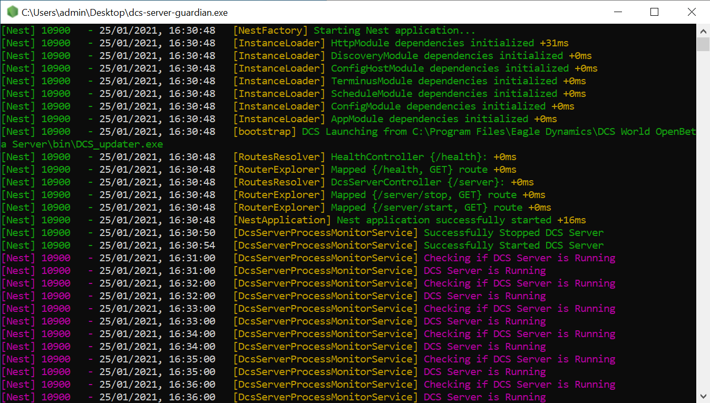
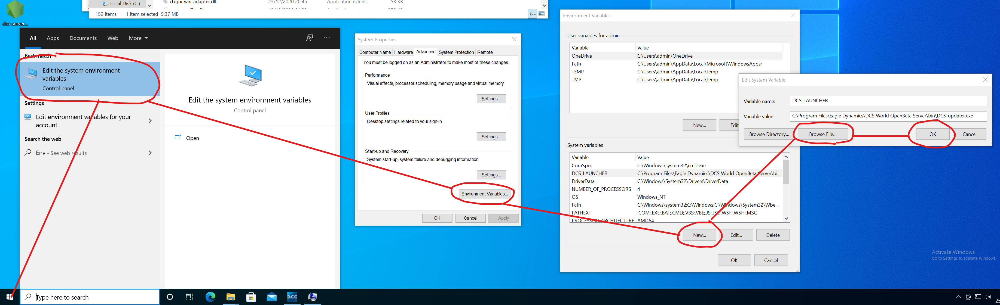
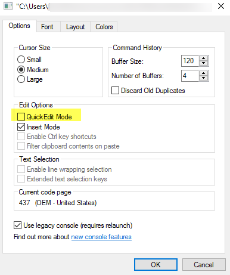

## DCS Server Guardian Service

This application provides overwatch for the DCS Server Application which can then be polled by
monitoring solutions such as [UptimeRobot](https://uptimerobot.com/),
[CheckMK](https://checkmk.com/) etc


_(Note you will see a blank screen as only Warn and Error logs are on by default)_

It looks at the Tasklist to see if `DCS.exe` exists, and also sends a request to
`http://localhost:8088/encryptedRequest` and confirms its responding.

If it's not running/not responding the server will be stopped and restarted.

Utility endpoints also exist at `/health`, `/server/stop`, `/server/start` to perform associated
actions on the server.

Sample Response from the health endpoint:

```json
// http://localhost:45371/health
{
  "status": "ok",
  "info": {
    "dcs-server": {
      "status": "up",
      "process": {
        "imageName": "DCS.exe",
        "pid": 11244,
        "sessionName": "",
        "sessionNumber": 1,
        "memUsage": 2237923328
      }
    }
  },
  "error": {},
  "details": {
    ...
  }
}
```

## Usage

1. On the DCS server host define a `SYSTEM` environment variable named `DCS_LAUNCHER`, this should
   point to the `DCS_updater.exe`



2. Download and run the exe on the DCS Server host

3. Disable `QuickEdit` mode in the terminal (Right Click (Top Bar) > Properties), this will cause
   the app to hang if not disabled
   see https://stackoverflow.com/questions/33883530/why-is-my-command-prompt-freezing-on-windows-10



Navigate to `http://127.0.0.1:45371/health` in a browser to get the health information for the
guardian and dcs server

Navigate to `http://127.0.0.1:45371/server/stop` to stop the
server, `http://127.0.0.1:45371/server/start` to start it.

## Development

### Installation

```bash
$ yarn install
```

### Running the app

```bash
# development
$ yarn run start

# watch mode
$ yarn run start:dev

# production mode
$ yarn run start:prod
```

### Generating the DCS.exe stub

If you don't have DCS installed and want to develop the app, the project contains a dcs-stub app
with endpoints exposed such as http://127.0.0.1:8088/encryptedRequest

Build it and the [dotenv](.env) file will point at it, or replace the contents of the `.env`
file to point to an actual `DCS_updater.exe` file

```bash
$ yarn build:stub
```

### Running the tests

```bash
# unit tests
$ yarn run test

# e2e tests
$ yarn run test:e2e

# test coverage
$ yarn run test:cov
```

### Building

```bash
$ yarn build
```

This Produces a distributable bundle `dcs-server-guardian.exe` which can be distributed without any
additional requirements except the steps as listed above. The app is a portable executable so
requires no installation.

## Support

Raise any issues in the github repo

## License

dcs-server-guardian is [MIT licensed](LICENSE).
